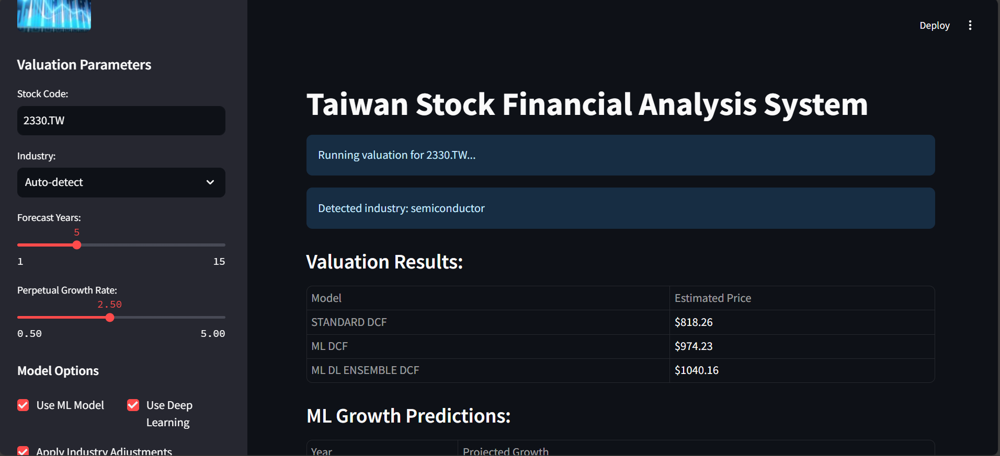
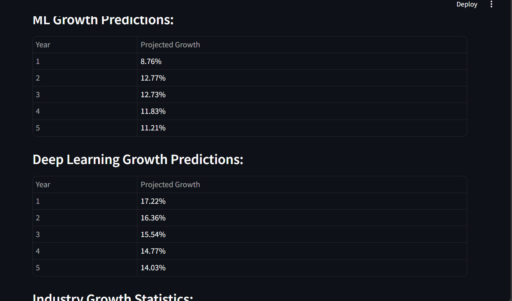

# Taiwan Stock Financial Analysis System

A comprehensive system for financial data collection, analysis, and stock valuation with a focus on Taiwan stock market.

## Overview

This project provides a suite of tools for financial analysis and stock valuation with special enhancements for Taiwan stocks. It includes:

- Background data collection with rate limiting (respects API constraints)
- Industry-specific valuation models using machine learning
- DCF (Discounted Cash Flow) models with ML and deep learning enhancements
- Data visualization and analysis tools with Streamlit interface
- News integration for real-time valuation adjustments (Coming Soon)
- Advanced industry detection for Taiwan stocks
- Chemical industry classification support
- Robust error handling and fallbacks

## Screenshots

### Main Valuation Interface


The main Streamlit interface showing comprehensive stock valuation results including:
- Multiple valuation models (Standard DCF, ML DCF, ML+DL Ensemble)
- Automatic industry detection
- Real-time valuation calculations

### Growth Predictions Dashboard


Detailed growth predictions showing:
- ML-powered growth rate forecasts
- Deep learning growth predictions
- Industry growth statistics and benchmarks
- Year-over-year growth analysis

## Installation

### Prerequisites
- Python 3.8 or higher
- A FinMind API key (for Taiwan stock data collection)

### Setup

1. Clone the repository:
   ```
   git clone https://github.com/Shawn-lung/Taiwan-Stock-Financial-Analysis.git
   cd Finance_stuff
   ```

2. Install required packages:
   ```
   pip install -r requirements.txt
   ```

3. Create a `.env` file in the project root with your API keys:
   ```
   FINMIND_TOKEN=your_finmind_token_here
   ```

## System Components

### Data Collection

- `background_data_collector.py`: Collects financial data in the background with rate limiting (300 calls per hour)
- `industry_data_collector.py`: Collects industry-specific financial data for model training
- `data_fetcher.py`: Core module for fetching financial data with caching support

### Valuation Models

- `dcf_model.py`: Discounted Cash Flow model for stock valuation 
- `industry_valuation_model.py`: ML-based industry-specific valuation adjustments
- `ml_predictor.py`: Machine learning model for growth prediction
- `deep_learning.py`: Deep learning models for financial forecasting with improved industry detection
- `Wacc.py`: Weighted Average Cost of Capital calculation with industry-specific adjustments

### Integration

- `dcf_integrator.py`: Integrates all models (DCF, ML, DL, and industry-specific) for comprehensive valuation
- `train_models_from_db.py`: Trains models using data from the database
- `streamlit_app.py`: Interactive web interface for stock valuation

### News Integration (Coming Soon)

- News data collection from various sources
- Natural Language Processing (NLP) for sentiment analysis
- Real-time valuation adjustments based on market and company news
- Enhanced growth predictions incorporating news sentiment

## Recent Improvements

- **Enhanced Industry Detection**: Improved classification system for Taiwan stocks, especially chemicals (4763.TW) and other specialized industries
- **Robust Error Handling**: Better handling of null values and missing data in financial statements
- **DCF Model Enhancement**: Added safeguards against None values in industry adjustments
- **Streamlit Interface**: Interactive web interface for easy model usage
- **Data Caching**: Optimized data retrieval with local caching for better performance
- **Industry-Specific Models**: Added more industry-specific training data and models
- **Chemical Industry Support**: Specialized support for chemical companies

## Usage Examples

### Running the Streamlit Web App

The easiest way to use the system is through the Streamlit web interface:

```bash
streamlit run streamlit_app.py
```

This will open a browser with an interactive interface where you can:
- Enter a Taiwan stock code
- View financial data and metrics
- Run valuation models with customizable parameters
- See visual representations of growth projections

### Data Collection

Start the background data collector to build your database:

```python
from background_data_collector import BackgroundDataCollector

# Create collector and start it running
collector = BackgroundDataCollector(
    db_path="finance_data.db",
    collection_interval=8  # Check every 8 hours
)

# Start the background collection scheduler
collector.start_scheduler()

# Check collection progress
stats = collector.get_db_stats()
print(f"Stocks with complete data: {stats.get('stocks_with_complete_data', 0)}")
```

### Training Models

Train industry-specific valuation models:

```python
from train_models_from_db import train_industry_models_from_db

# Train models using database data
success = train_industry_models_from_db()
```

### Running Valuations

Run a comprehensive valuation with all model components:

```python
from dcf_integrator import IntegratedValuationModel

# Initialize the model with all components
model = IntegratedValuationModel(use_ml=True, use_dl=True, use_industry=True)

# Run valuation for a specific stock
result = model.run_valuation("2330.TW", "semiconductors")

# Print results
print(f"\nValuation Results for {result['ticker']}:")
for model_name, price in result['models'].items():
    print(f"  {model_name.replace('_', ' ').title()}: {price:.2f}")
```

## Advanced Features

### Industry Classification

The system includes sophisticated industry detection for Taiwan stocks:

- Pattern-based detection for Taiwan stock codes
- Specialized industry mappings (semiconductors, chemicals, electronics, etc.)
- Financial ratio-based classification as fallback
- Industry-specific growth models and valuations

### WACC Calculation

Weighted Average Cost of Capital calculation with:
- Country-specific risk adjustments
- Industry-specific risk premiums
- Custom adjustments for Taiwan market
- Robust error handling with fallbacks

### Deep Learning Growth Prediction

Advanced growth forecasting models:
- LSTM networks for time series prediction
- Attention mechanisms for capturing complex patterns
- Industry-specific training datasets
- Ensemble methods for improved accuracy

## Rate Limiting

Both collectors implement rate limiting to avoid hitting FinMind API limits:

- **Limit**: 300 API calls per hour
- **Behavior**: Automatically pauses when the limit is reached and resumes after the hour window

## Database Structure

The system uses SQLite to store financial data. Key tables include:

- `stock_info`: Basic stock information and industry classification
- `financial_statements`: Income statement data
- `balance_sheets`: Balance sheet data
- `cash_flows`: Cash flow statement data
- `stock_prices`: Historical price data
- `collection_log`: Log of data collection attempts
- `news_data`: Company and market news with sentiment analysis (Coming Soon)

## ETF Filtering

The system automatically detects and filters out ETFs (Exchange Traded Funds) during data collection, because:

1. ETFs don't have traditional financial statements like companies do
2. DCF valuation models aren't applicable to ETFs
3. Including ETFs would waste API calls and storage space

ETF detection is based on Taiwan market stock code patterns, including:
- Leveraged ETFs (ending with "L" like 00650L)
- Inverse ETFs (ending with "R" like 00651R)
- Standard ETF numbering patterns (006xx, 00[6-9]xx series)
- Famous ETFs like 0050 (Taiwan 50 ETF)

## Planned Features

### News-Enhanced Valuation

The system is being enhanced to incorporate news data into the valuation process:

1. **News Collection**: Automated gathering of company-specific and market news
2. **Sentiment Analysis**: NLP models to evaluate news sentiment (positive/negative/neutral)
3. **Impact Assessment**: Algorithms to determine potential impact on growth projections
4. **Dynamic Adjustments**: Automatically adjust valuation models based on significant news
5. **Alert System**: Notify users of significant news that may affect stock valuation

This feature will allow the system to keep pace with new information and provide more timely valuation adjustments, especially during periods of rapid market change or company-specific events.

### Additional Planned Improvements

- **Multi-language Support**: Enhanced processing of Chinese financial news
- **Real-time Market Data**: Integration with more real-time data sources
- **Portfolio Management**: Tools for managing and analyzing stock portfolios
- **Risk Assessment**: Advanced risk metrics and scenario analysis
- **Market Correlation Analysis**: Study relationships between different sectors

## Notes

- The system is optimized for Taiwan stocks, particularly those listed on TWSE and TPEx
- Industry classification is standardized across different data sources
- Data collection is designed for long-term background operation to build up a comprehensive database
- Error handling is robust to handle missing or inconsistent financial data

## License

This project is licensed under the MIT License - see the [LICENSE](LICENSE) file for details.
